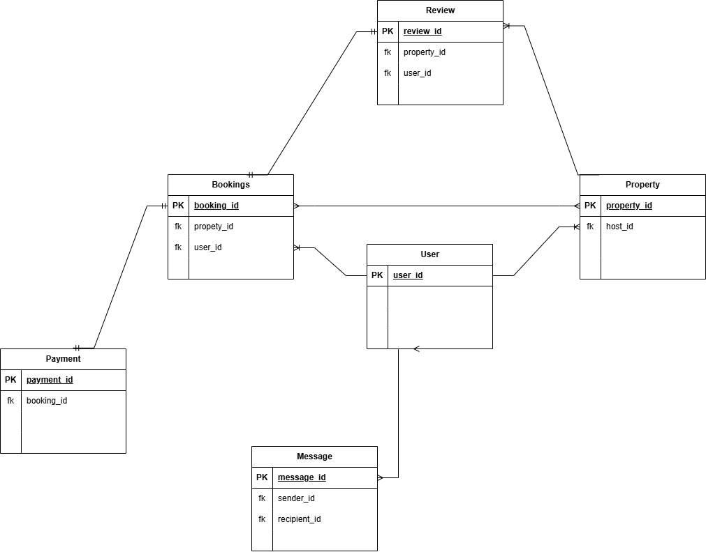

# Documentation for Airbnb Clone Entity-Relationship Diagram (ERD)

This document explains the Entity-Relationship Diagram (ERD) for the Airbnb Clone project, as detailed in the `ERD/requirements.md` file. The ERD provides a visual representation of the database schema, showing the entities (tables) and the relationships between them.

## ER Diagram

Below is the ER diagram for the Airbnb database.

## Entities and Relationships

The ERD shows the following entities and their relationships:

*   **User:** Represents the users of the application.
*   **Property:** Represents the properties listed on the platform.
*   **Booking:** Represents the bookings of properties by users.
*   **Payment:** Represents the payments made for bookings.
*   **Review:** Represents the reviews of properties by users.
*   **Message:** Represents messages sent between users.

The relationships between these entities are as follows:

*   A **User** can have multiple **Properties** (a one-to-many relationship).
*   A **User** can have multiple **Bookings** (a one-to-many relationship).
*   A **Property** can have multiple **Bookings** (a one-to-many relationship).
*   A **Booking** has one **Payment** (a one-to-one relationship).
*   A **Property** can have multiple **Reviews** (a one-to-many relationship).
*   A **User** can write multiple **Reviews** (a one-to-many relationship).
*   A **User** can send and receive multiple **Messages** (a one-to-many relationship for both sender and receiver).
