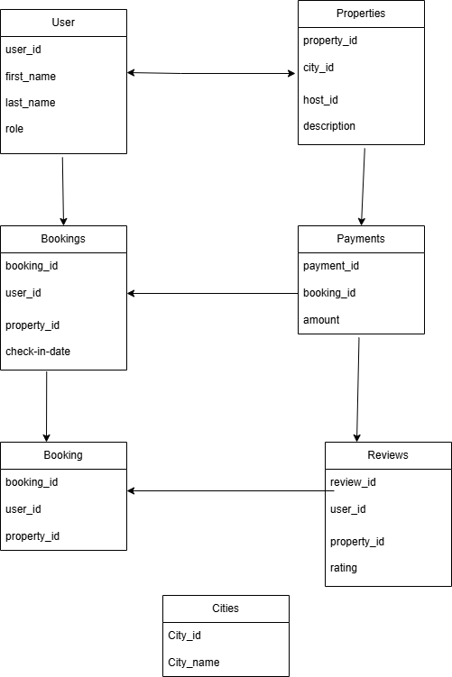

# Documentation for Airbnb Clone Database Normalization

This document explains the database normalization process for the Airbnb Clone project, as detailed in the `normalization.md` file. The normalization process is a technique used to organize the data in a database to minimize redundancy and improve data integrity.

## Normalization Process

Below is the diagram illustrating the normalization process for the Airbnb database.

## Explanation of the Normalization Process

The diagram shows the progression of the database schema through the different normal forms.

*   **First Normal Form (1NF):** The initial step is to ensure that all table columns hold atomic values (i.e., each cell holds a single value). The schema is already in 1NF as all attributes are single-valued.

*   **Second Normal Form (2NF):** A table is in 2NF if it is in 1NF and all non-key attributes are fully functional dependent on the primary key. This means that we need to eliminate partial dependencies. In our schema, all tables have a single primary key, so there are no partial dependencies. Therefore, the schema is in 2NF.

*   **Third Normal Form (3NF):** A table is in 3NF if it is in 2NF and there are no transitive dependencies. A transitive dependency is when a non-key attribute depends on another non-key attribute. The provided schema is already in 3NF as there are no transitive dependencies. For example, in the `Property` table, the `location` does not depend on the `name` or `description`.

By following these normalization rules, the database schema is designed to be efficient, scalable, and maintainable.
